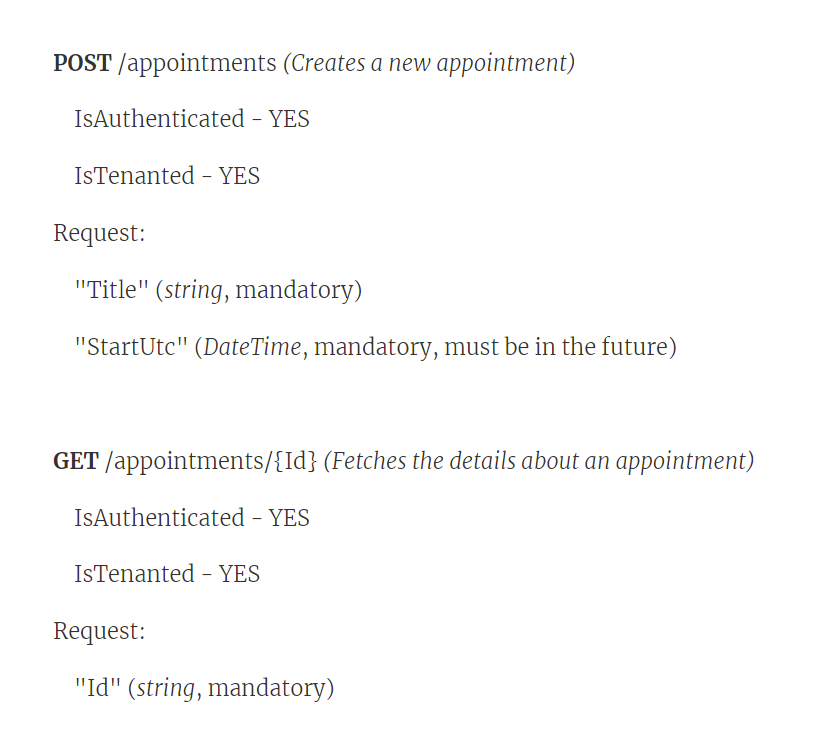

# Demo Script

## Preamble

Hello everybody, my name is Jezz Santos, and I am the developer of the **automate** project.

Today, I would like to show you a demo of **"automate"** and what it can do for you.

It is a command-line tool that can be used on any codebase (any language, and any stack, any platform) AND it is only appropriate where there already exists a codebase with some **coding patterns** that have **already been established**.

Most codebases that "more than one person" works on have established coding patterns and conventions that are followed by everyone.

It turns out that these kinds of patterns are not cast in concrete **forever**, they ***should*** change over time.

So any tooling that we want to invest time in building to support these patterns should also change over time, lock step with the codebase, as it changes.

That way the tooling and the code that it produces stay up to date. As it all should with product development.

I'm going to show you how this kind of tooling works, using an example **codebase** where there are plenty of **well agreed to** coding patterns and conventions to follow.

## What is a good pattern?

One of the things you do in this kind of codebase is build API's - the REST variety.

My tech lead Mary has asked me to create a couple of new APIs for making appointments, and we've decided to create a new domain in the product that we are going to call "**Appointments**".

Normally, when I go to create a new domain for this codebase, I'll follow a prescriptive set of guidance that we have in our **CONTRIBUTING.md** document that reminds me of all the steps I need to take.

Even though it has all the details I need, it still takes me more than an hour to complete the process of following all the steps, and it is lots of cutting and pasting.

To be frank, even though it tells me exactly what to do and where to do it, and how it is pretty tedious to follow and I'm often taking shortcuts in the long process, or being interrupted. Asa result of these distractions, I often end up making some silly copy/paste mistake that takes me another hour to find and fix.

So, I am keen to try some of Mary's new tooling to help me do this stuff more reliably and faster.

OK, so my tech lead (Mary) and I have been talking about this new API, and what it should do, and we came up with this definition of what we need right now, on the whiteboard.

------

**POST** /appointments *(Creates a new appointment)*

- IsAuthenticated - YES
- IsTenanted - YES

HTTP Request:

```
"Title" (*string*, mandatory)
"StartUtc" (*DateTime*, mandatory, must be in the future)
```

**GET** /appointments/{Id} *(Fetches the details about an appointment)*

- IsAuthenticated - YES
- IsTenanted - YES

HTTP Request:

```
"Id" (*string*, mandatory)
```

------

Now, the **Appointments** API is a whole new domain for us, so I have about **8x** different projects to set up just to get started with writing my API.

We have projects for all the layers in the architecture: an **API project**, an **Application project**, a **Domain project** and a **Storage project**, and then we have a unit and integration testing projects for each of those projects.

So, 8x projects in total have to be created with all the other code files within them to get started.

Something like ~30 files, with about ~400 lines of code. Before I can craft my API.

Again, our **CONTRIBUTING.md** document guides me through the whole thing step by step. Which, if I follow rigorously, I'll get all set up in about an hour.

But, I'm going to try this new toolkit my tech lead (Mary) asked me to try out. So here goes.

## Defining the API

I'm in the root of my source code repository, where I need to be for this:

`queryany\samples\ri`

The next thing I'm gonna do is install this tool called **automate.exe**

It is on Nuget already as a tool, so that's a pretty easy step.

```
dotnet tool install --global automate --version 0.2.0-preview
```

Then, I am going to install this toolkit Mary gave me this morning to use.

```
automate install toolkit "C:\Users\jezzs\OneDrive\Desktop\RestAPI_0.11.0.toolkit"
```

OK, now I've installed this command-line tool my tech lead gave me this morning, so let's now see what toolkits I have installed:

```
automate list toolkits
```

OK, looks like I have the "**RestAPI**" toolkit installed - version 0.11.0 - that's the one I want to use

Let's quickly have a look at the structure of this API toolkit:

```
automate view toolkit
```

This shows me that:

* we have a root element called "RestAPI"
* it has a property called "DomainName",
* and it also has a collection of "ServiceOperation"(s).
* Each "ServiceOperation" has a few properties like "Name", "Route", "Kind" "IsAuthorized" and "IsTenanted".
* AND, each "ServiceOperation" has a "Request" element, that has one or more "Field"(s),
* AND each "Field" has a couple of properties like "Name" and "DataType" and "IsOptional".

Cool! looks to be exactly how my tech lead and I understand (in our heads) how to a REST API Operation works.

Fits this picture pretty well by the looks.



Great, now I'm going to use this toolkit to create me a new instance of the pattern for the **AppointmentsAPI**:

```
automate run toolkit "RestAPI" --name AppointmentsAPI 
```

that makes me something called a "draft" which has a default name `AppointmentsAPI`

Now, I need to setup the new Appointments API, and give it some names of things:

```
automate configure on "{RestAPI}" --and-set "DomainName=Appointment"
```

OK, this looks good, now we have 2 API's to build one for POST and one for GET, so lets do that now.

First the **POST**:

```
automate configure add-one-to "{RestAPI.ServiceOperation}" --and-set "Name=Create" --and-set "Route=/appointments" --and-set "Kind=POST"
```

I now need the ID of the ServiceOperation we just created.

OK, now I can configure the inbound HTTP Request:

```
automate configure add-one-to "{RestAPI.ServiceOperation.?.Request.Field}" --and-set "Name=Title" --and-set "DataType=string"
```

AND

```
automate configure add-one-to "{RestAPI.ServiceOperation.?.Request.Field}" --and-set "Name=StartUtc" --and-set "DataType=DateTime"
```

AND the same kind of thing for the **GET**:

```
automate configure add-one-to "{RestAPI.ServiceOperation}" --and-set "Name=Get" --and-set "Route=/appointments/{Id}" --and-set "Kind=GET"
```

I need the ID of that ServiceOperation we just created.

OK, now I can configure the inbound HTTP Request:

```
automate configure add-one-to "{RestAPI.ServiceOperation.?.Request.Field}" --and-set "Name=Id" --and-set "DataType=string"
```

Great! now that's pretty much all there is to it.

I now have defined my two API's, I'm just about done here.

Apparently, my tech lead (Mary) has created for me a command called "Generate" so let's use that now!

```
automate execute command "Generate"
```

Woah! a lot of things happened there, a bunch of files were created for me, and a bunch of projects were added to the solution.

let's have a look around my codebase!
