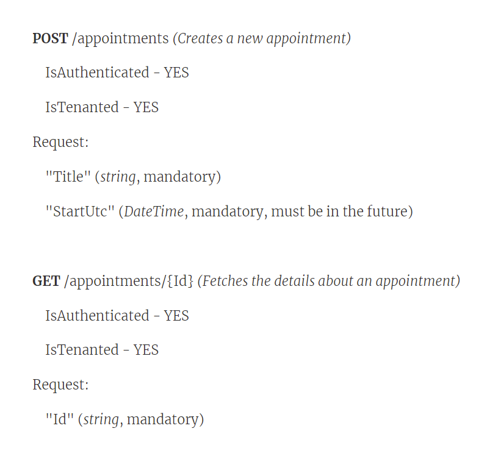

# Demo Script of automate in action

> Any person can present this demo using what is already available on github.com at: https://github.com/jezzsantos/automate/tree/main/discovery/demo)

## Preamble

Hello everybody, my name is ????,

Today, I would like to show you a demo of   **"automate"** and what it can do for you.

It is a command-line tool that can be used on any codebase (any language, any stack, any platform) AND it is only appropriate where there already exists a codebase with some **coding patterns** that have **already been established**.

### Who is this for?

Most codebases where "more than one person" works on it, have established coding patterns and conventions that are intended to be followed by everyone in that codebase.

Consistency is key to keeping the code from rotting over long periods of time.

It turns out that these kinds of coding patterns are not cast in concrete **forever**, they ***should*** change over time, as the code does, and will.

So any tooling that we want to invest time in building to support these patterns should also change over time, lock-step with the codebase, as it changes, and ideally versioned within the same codebase.

That way, the code and the tooling (that produces some of that code), both stay up to date and in sync.

> As it all should be with all product development since we are taking the long-term view in these cases.

I'm going to show you how this kind of tooling works, using an example **codebase** where there are plenty of **well agreed** coding patterns and conventions to follow.

### The codebase

Clone the [QueryAny](https://github.com/jezzsantos/queryany.git) codebase from GitHub.

QueryAny contains a small and useful Library component, but we are more interested in the included "Reference Implementation" that comes with it, where there is a real-world production codebase demonstrating a common use of the library component.

Open this `QueryAny.sln` in an IDE such as JetBrains Rider or Visual Studio.

This codebase is a DDD-based codebase containing two existing sub-domains: `Cars` and `Persons`.

We will be adding another sub-domain to this codebase called `Appointments`, as the next feature.

### What is a good pattern?

One of the things you do in this kind of codebase is build APIs - the REST variety.

My tech lead Mary has asked me to create a couple of new APIs for making appointments, and we've decided to create a new sub-domain in the product that we are going to call "**Appointments**".

Normally, when I go to create a new sub-domain for this kind of codebase, I'll usually follow documented guidelines that someone on the team has written for us, for when creating a major piece of a codebase like this. Or perhaps I just know what to do and how to do it every time, which is harder because creating a new sub-domain may only happen once every couple of months. So it is easy to forget all the pieces, and that usually has me copying and pasting and comparing with existing sub-domains. It's a tedious process, but it has to be done right, and it has to be consistent.

Even though I may know exactly what to do, it still takes me more than an hour to complete the process of following all the steps, and it is lots of cutting and pasting.

To be frank, I'm often taking shortcuts in the long process, and it's common to be interrupted in the process, so I often end up making some silly copy/paste mistake that takes me another hour to find and fix.

So, I am keen to try some of Mary's new tooling to help me do this stuff more reliably and faster.

## API Summary

OK, so my tech lead (Mary) and I have been talking about this new API that we need to build, and what it should do, and we came up with this definition of what we need right now, on the whiteboard.

------

**POST** /appointments *(Creates a new appointment)*

- IsAuthenticated - YES
- IsTenanted - YES

HTTP Request:

```
"Title" (*string*, mandatory)
"StartUtc" (*DateTime*, mandatory, must be in the future)
```

**GET** /appointments/{Id} *(Fetches the details about an appointment)*

- IsAuthenticated - YES
- IsTenanted - YES

HTTP Request:

```
"Id" (*string*, mandatory)
```

------

Now, the **Appointments** API is a whole new domain for us, so I have about **8x** different projects to set up just to get started with writing my API in this codebase.

We have projects for all the layers in the architecture: an **APIHost project**, an **Application project**, a **Domain project**, and a **Storage project**, and then we have a unit and integration testing projects for most of those projects.

So, **8x** projects in total have to be created with all the other code files within them to get started.

Something like ~30 files, with about ~400 lines of code, have to be created by hand before I can begin to craft my API!

Again, a boring and tedious process of copying and pasting which, even if I follow rigorously and flawlessly, I'll get all set up in about an hour.

But, I'm going to try this new toolkit my tech lead (Mary) asked me to try out.

So here goes.

## Defining the API

I'm going to change the root of my source code repository, where I need to be for this, now to:

`cd ..\samples\ri` *(this is where the R.I. code actually lives on disk)*

The next thing I'm gonna do is install this tool called **automate.exe**

> automate.exe is already on Nuget.org as a tool, so it simple to install on any .Net machine.

```
dotnet tool install automate --global --version 0.2.4-preview
```

Then, I am going to install this new toolkit Mary gave me this morning to use.

> First I must manually copy the `RestAPI_0.8.0.toolkit` file (from this repo) to my desktop and hit his command:

```
automate install toolkit "%UserProfile%\Desktop\RestAPI_0.8.0.toolkit"
```

OK, now I've installed this command-line tool my tech lead gave me this morning, so let's now see what toolkits I have installed:

```
automate list toolkits
```

OK, looks like I have the "**RestAPI**" toolkit installed - that's the one I want to use

## The Model

Let's quickly have a look at the structure of this API toolkit:

```
automate view toolkit
```

This shows me that:

* We have a root element called "RestAPI"
* It has a property called "DomainName",
* It has a collection of "ServiceOperation"(s).
* Each "ServiceOperation" has a few properties like "Name", "Route", "Kind" "IsAuthorized" and "IsTenanted".
* AND, each "ServiceOperation" has a "Request" element, that has one or more "Field"(s),
* AND each "Field" has a couple of properties like "Name" and "DataType" and "IsOptional".

Cool! looks to be exactly how my tech lead and I understand (in our heads) how to a REST API Operation is programmed in our codebase.

Fits this picture pretty well by the looks.



## Use the toolkit

Great, now I'm going to use this toolkit to create a new instance of the pattern for our **AppointmentsAPI**:

```
automate run toolkit "RestAPI" --name AppointmentsAPI 
```

That makes something called a "draft" which has a default name `AppointmentsAPI`

### Define the new API

Now, I need set up the new Appointments API, and give it the names of some things:

```
automate configure on "{RestAPI}" --and-set "DomainName=Appointment"
```

OK, this looks good, now we have 2 API's to build one for POST and one for GET, so let's do that now.

First the **POST** API:

```
automate configure add-one-to "{RestAPI.ServiceOperation}" --and-set "Name=Create" --and-set "Route=/appointments" --and-set "Kind=POST"
```

I now will need to copy and paste the ID of the ServiceOperation we just created.

OK, now I can configure the inbound HTTP Request:

```
automate configure add-one-to "{RestAPI.ServiceOperation.<SERVICEOPERATIONID>.Request.Field}" --and-set "Name=Title" --and-set "DataType=string"
```

> But, I will need to copy and paste the value of the previously created Service Operation into the value of `<SERVICEOPERATIONID>` above.

AND then:

```
automate configure add-one-to "{RestAPI.ServiceOperation.<SERVICEOPERATIONID>.Request.Field}" --and-set "Name=StartUtc" --and-set "DataType=DateTime"
```

Do the same kind of thing for the **GET** API:

```
automate configure add-one-to "{RestAPI.ServiceOperation}" --and-set "Name=Get" --and-set "Route=/appointments/{Id}" --and-set "Kind=GET"
```

OK, now I can configure the inbound HTTP Request:

```
automate configure add-one-to "{RestAPI.ServiceOperation.<SERVICEOPERATIONID>.Request.Field}" --and-set "Name=Id" --and-set "DataType=string"
```

> I'll need that ServiceOperation ID we just created, again!

#### Run the toolkit automation

Great! now that's pretty much all there is to it.

I now have defined my two API's, I'm just about done here.

Apparently, my tech lead (Mary) has created for me a command called "Generate" so let's use that now!

```
automate execute command "Generate"
```

Woah! a lot of things happened there, a bunch of files were created for me, and a bunch of projects were added to the solution!

That was pretty slick

Now, let's explore the codebase and what it did for us!


