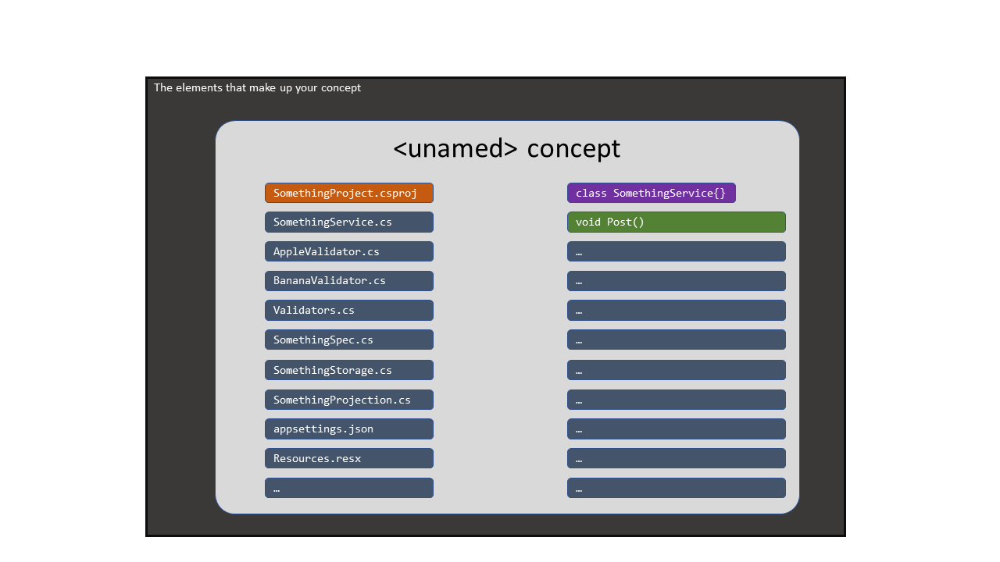
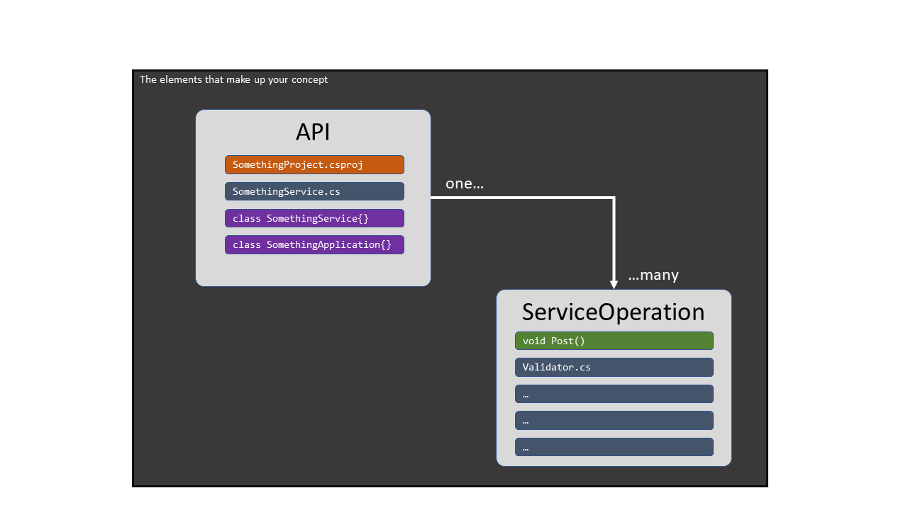

# Potential Plugin Experience

We don't just want to give the user a hierarchical editing experience to build their own structure from scratch. Particularly first-time users. They won;t know how to think about using it, let alone with being distracted about how to make it work.

They may not (strongly) be in the mindset of building abstractions over the abstractions they have in their code yet. So they will need some help to get there.

> We expect that the user is not experienced in thinking about their code as a model (at one level), or even in these higher levels of abstractions of their code, and so they may fail to get started modelling their coding pattern.

Instead, we want a **robot** to help them realise their initial pattern, by walking them through a guided process.

It all starts by asking them to select the code elements that they *"wish to repeat, again."*

## Overall process

We need to start by asking them to select a range of things to start with. (or they make a selection, and we give them a command to start the process)

1. Then, ultimately, the job of the robot is to help them construct from that "range" a set of related concepts.

2. From these concepts, the tool can help you identify potential variability in each of those concepts.

3. From that information, the toolkit might be able to suggest how to recreate the things in the range based on that model.

## Step 1: Capture a range of things

The capture of a range of things can be at many different levels since codebases are naturally hierarchical.

Examples:

* Select a solution or solution folder - means that the range is a range of projects (1-level)
* Select a number of projects - means a specific set of projects (1-level)
* Select a number of files from across a range of projects - means a specific set of files across a specific set of projects (2-levels)
* Select an individual code class or an individual function of a class (1-level, language-specific)

See this video for how that could look (when starting the process with a selection of their own)

<video src="Selecting The Range/Selecting The Range.mp4" />

I am thinking of a top-level context menu called: "Extract coding pattern...".

* It does not fit in the "Refactor" menu, since refactoring is about improving the structure of your code.

In any case, the result is some experience that provides introspection into either:

* the "virtual" structure of the solution to retrieve a range of things (projects/files).
* or the internal structure of a code or configuration file (language dependent)

## Step 2: Suggest an initial concept to represent the range of things

The user will then see the range of things represented visually in a single concept.

The robot would present all the things, and ask the user to suggest a name for the thing, (and perhaps a simple description of what it is).

Naming might need to be suggested to them, based on their answer to a question like this:

* *"Before we get into the breakdown of this thing, what would you call one of these things if you were to create one again in your codebase?"*

## Step 3: Auto-Suggest a set of relationships of the main concept

By looking into (analysing) the range of things/items, even by just examining their type and naming alone, we can tease out some naming patterns.

e.g. we may also find use in the types of thing it is (e.g. project, folder, file, class, function etc)

e.g. names that start or end in the same terms (e.g. lots of items ending with the same term: Validator, Manager, Service, etc) or starting with the same term "Car". Pascal/Camel cased names can be broken into words, and those words can be matched with other items in the range.

Where we see that more than one item in the range matches another item, we can suggest that the main concept has some kind of relationship to another concept (yet to be defined).

The robot can now suggest some new related concepts that could be teased out:

* Any single occurrence would imply it is part of the main concept. But that does not mean that those things could not be placed in a related singleton concept. The user would have to make that relationship explicit themselves.
* If the robot saw 3x validator-type files, it could suggest that a validator is part of another child-concept, but won't know what the user would call it
* The robot could see that there are several sets of things in the range, which it might suggest also belong in a separate concept. So, it could see that a Validator concept and a certain Function concept might be represented in a child-concept. The challenge is how to show that as a suggestion to the user?
* Any child concept will need to be either a OneToOne or OneToMany concept, which the user will have to confirm themselves.
* The user will need to name the child concept, and define this cardinality. The user may be asked to define whether there must be at least one instance or whether it can support zero instances.
* Then how does the robot identify a breakdown of a child-concept into another grandchild-concept? How will it know to suggest that?

Design Principles:

* Every step (that the tool can help suggest) helps teach the user how to think about how to think with this tool. To understand the conceptual model of the tool (pattern/templates/toolkits, etc).
* 

 

