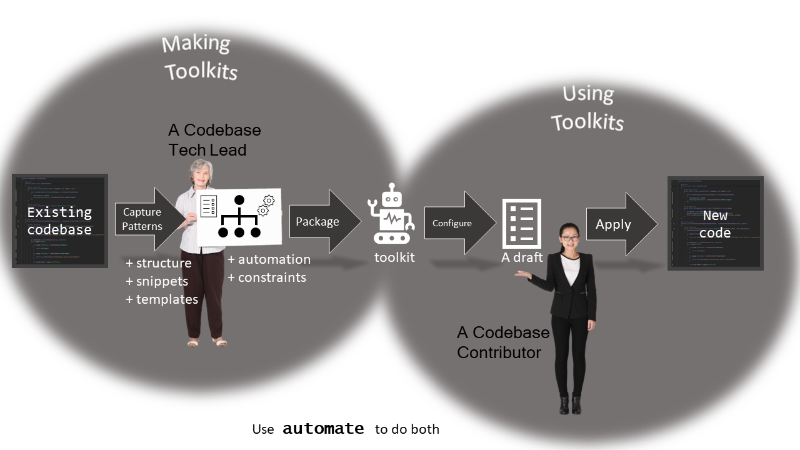

# How It Works

There are two distinctive modes of use of automate

## [Making Toolkits](authoring.md)

A Tech Lead/Tech Consultant will use `automate` to capture and define a coding patterns based on code in an existing codebase.

They will:

1. Name the pattern
2. Configure its structure and its attributes, and how they vary
3. Configure any automation, to apply the pattern to another codebase
4. Publish a toolkit from it, for distribution to another codebase
5. Deploy that toolkit to a team to use, or install it into an existing codebase

## [Using Toolkits](runtime.md)

Contributors on a codebase will then use `automate` to run a toolkit on their codebase.

They will:

1. Install a toolkit locally (unless already installed into the codebase)
2. Create a "draft" use-case with the toolkit
3. Configure the draft (according the pattern)
4. Execute any automation (in the toolkit) to apply the changes to their codebase

!!! info
    The toolkit then applies the structure, templates and automation to their codebase.